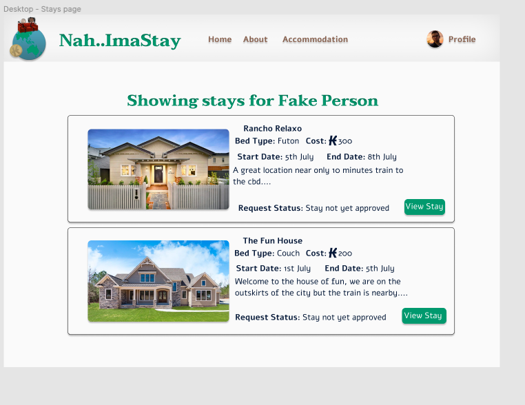
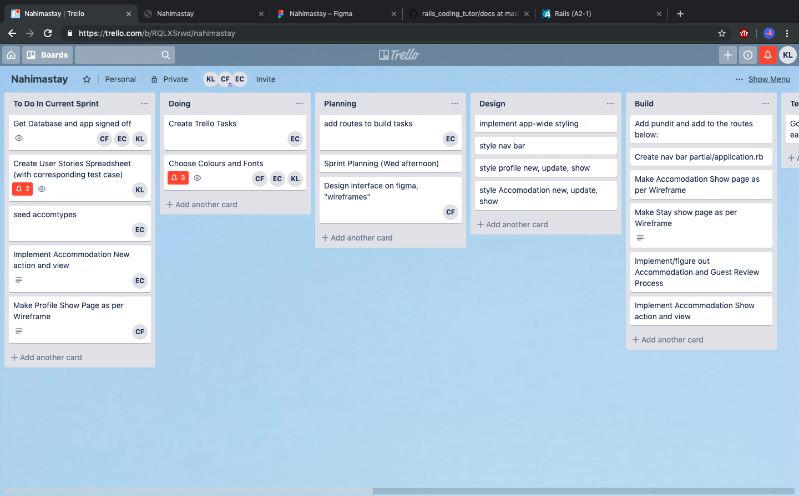
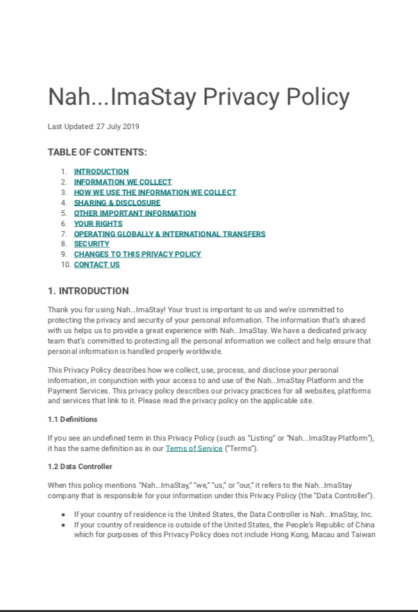

# README
## Contributors
|[] https://github.com/The4Star|
[] https://github.com/|
[] https://github.com/klps007|

|-----------------|---------------|-------------|
| Clinton Forster | Emma Cullen   | Kristy Lake |

### Links

URL - fxgSfgsfgfsgsz
GitHub - https://github.com/nahimastay

### Section 1 - Description
### Section 2 - Design Documents
### Section 3 - Planning Process
### Section 4 - Short question answers

# SECTION 1 - DESCRIPTION

### Purpose 

A reciprocal platform where travellers host and stay at each others homes in return for karma Coins.

Karma coins are earnt by hosting travellers first and can then be saved up and spent on your own stays along your journey.

Let us break it down for you

Hosting people first gives you the chance to see if sharing space with a new friend is something you are comfortable with before you start your own travels.

It also gives the person that stays with you a chance to let everyone else know how great a host you were, making people much more willing to host you and leaving all members of the community feeling secure.

Karma Coins?

These are a currency exclusive to Nah..ImaStay. They don't cost any money but you do need to earn them to spend them simply by hosting your fellow travellers and making new friends.

Guests review their hosts and vice versa so that future hosts and guests can see how great it is to meet you and feel safe!

The more people you host the more Karma Coins you'll earn and the more you can travel without spending any real money! Simple!

### Functionality / Features

* Secure Login, User Authentication and Authorization
* Profile Simple User friendly interface displaying both guest and host data
* Profile Photo and Accommodation Photos uploaded using AWS image Storage
* Simple User friendly interface 
* Search, view availability and book accommodation
* Host and guest can communicate directly via internal messaging system
* Membership upgrade premium payable through Stripe 
* Give and view accommodation review and rating
* Give and view guest review and rating
* View all past stay and future booked stays
* View all past guests and future booked guests
* View Karmer

### Tech Stack

Front-end: HTML, ERB, CSS, Sass, Javascript
Back-end: Ruby, Ruby on Rails
Database: PostgreSQL Database with ActiveRecord
Deployment: Heroku

### Configuration / Installation Instructions

In the terminal:

1. Copy and paste the following into the terminal where you want to install:

  	git clone git@github.com:The4star/nahimastay.git

2. change into the file:

    cd  nahimastay/

3. Input the following in terminal this will open postgres:
   	
    psql postgres

4. Then copy and paste the following: 

 	create role nahimastay with createdb login password '123456';

5. Exit out of progress back to terminal by entering:

     \q

6. Now input this to terminal

    rails db:create

7. And start the server with:

    rails s

8. Open browser and put the following in the address bar:

    localhost3000

### Site Map

This is our sitemap 

[] 

### Screenshots

Screenshots - Front End

[] []
[] []
[] []
[] []
[]

Screenshots - Back End

[] [] 

## SECTION 2 - DESIGN DOCUMENTATION 

### Design process

MockUps

Figma -  https://www.figma.com/file/fglPB5H0edn2CTdPFMvXS3/Nahimastay?node-id=0%3A1

[] []
[] []
[] [][] 

### A workflow diagram of the user journey/s.
 
 This is our workflow diagram of the users journey

[] 

### Database Entity Relationship Diagrams
 
 This is our database entity relationship diagram

[] 

## SECTION 3 - PLANNING PROCESS 

### Project plan & timeline

This is our initial project plan 

[] 

### Screenshots of Trello board(s)

Trello board

[] [] 
[] [] 
[] [] 

## SECTION 4 - Short Answer Questions (Section 2.2)

### 1. What is the need (i.e. challenge) that you will be addressing in your project?

Nah..ImaStay was created as a solution of making couch surfing more secure and safe.

Who doesn't love free accommodation and making new friends around the world and feeling safe while doing so?

Nah..ImaStay is a reciprocal society which means that everyone must host guests avoiding people simply travelling and not giving back.

When you host people you earn Karma Coins which you can then spend on your own travels.

### 2. Identify the problem you’re trying to solve by building this particular marketplace App? Why is it a problem that needs solving?

### 3. Describe the project will you be conducting and how. your App will address the needs.

### 4. Describe the network infrastructure the App may be based on.

### 5. Identify and describe the software to be used in your App.

RUBY ON RAILS - 

POSTGRES - 

ACTIVE RECORD -

GITHUB - 

HEROKU - 

### 6. Identify the database to be used in your App and provide a justification for your choice.

PostgreSQL extremely flexible and robus through  support for user-defined objects and their behaviors including data types,functions, operators, domains and indexes. 

It allows for complex data structures to be created, stored and retrieved and supports a variety of geometric data types such as points, lines, circles, and polygons

### 7. Identify and describe the production database setup (i.e. postgres instance).

Nah...ImaStay production database is an instance of a postgres database, hosted on Heroku.

### 8. Describe the architecture of your App.

Architecture Diagram

[] 

### 9. Explain the different high-level components (abstractions) in your App.

M (MODEL) - Handles the structure of the data in the database or object relationships / database associations 

V (VIEW) - Handles graphical user interface objects and presentaion to be rendered and returned to the browser 

C (CONTROLLER) - Handles the user interface and application, provides the logic and contains the functions requested by the web server receives request from browser, retreives requested data from model and sends to  views   

ACTIVE RECORD - Handles all the database related tasks and communication, establishes a connection with the database server, retreives data from tables and stores new data in the database

### 10.  Detail any third party services that your App will use.

Key Gems / Modules:

Pundit - User Authorization module used to manage users access to particular routes and sections of application protecting the integrity of the data

Devise - User Authentication module used to manage user registration, sign-in, passwords, confirmation etc

AWS / Active Storage - hosting service for image uploads via Amazon Web Services

Services:

S3 Module - Image Storage from Amazon Web Services

Stripe - Payment processing Software as a Service (SASS) from Stripe allowing users to pay Premium Membership Fees within the app using credit card.

Full List of Dependencies:

ruby "2.5.5"
gem "aws-sdk-s3", require: false
gem "rails", "~> 5.2.3"
gem "pg", ">= 0.18", "< 2.0"
gem "puma", "~> 3.11"
gem "sass-rails", "~> 5.0"
gem "uglifier", ">= 1.3.0"
gem "coffee-rails", "~> 4.2"
gem "turbolinks", "~> 5"
gem "jbuilder", "~> 2.5"
gem "bootsnap", ">= 1.1.0", require: false
group :development, :test do
gem "byebug", platforms: [:mri, :mingw, :x64_mingw]
group :development do
gem "web-console", ">= 3.3.0"
gem "listen", ">= 3.0.5", "< 3.2"
gem "spring"
gem "spring-watcher-listen", "~> 2.0.0"
group :test do
gem "capybara", ">= 2.15"
gem "selenium-webdriver"
gem "chromedriver-helper"
gem "tzinfo-data", platforms: [:mingw, :mswin, :x64_mingw, :jruby]
gem "devise", "~> 4.6"

### 11.Describe (in general terms) the data structure of marketplace apps that are similar to your own (e.g. eBay, Airbnb).

Airbnb - Built with Rails Airbnb uses Amazon Web Services for image uploads, users have one login for both host and guest users with information being displayed on separate profile pages. Relevant services are in place to handle the massive amounts of data

### 12. Discuss the database relations to be implemented.

We used the following datatbase relations one role has many Users, User has one profile, one role one accommodation review and one guest review , many stays, many messages and many accommodation types. On the other side of these relationships accommodation has one user, many stays, one accommodation review and many accommodation types with accommodation type having one accommodation. Stay belongs to and has one user, one accommodation review, one guest review and many messages

### 13. Describe your project’s models in terms of the relationships (active record associations) they have with each other.

User:
    belongs_to_and_has_one :user
    has_many :messages
    has_many :accommodation_types through :accommodation
    has_one :accommodation_review
    has_one :guest_review

Profile:
    belongs_to_and_has_one :user

Role:
    has_many :users

Accommodation:
    has_one :user
    has_many :stays
    has_many :accommodation_types
    has_one :accommodation_review through :stay 

Accommodation type:
    has_one :accommodation 

Accommodation Review:
    has_one :stay

Stay:
    belongs_to_and_has_one :user
    has_many :messages
    has_many :accommodation_types through :accommodation
    has_one :accommodation_review
    has_one :guest_review

Guest Review:
    has_one :stay

Message:
    has_one :stay

### 14. Provide your database schema design.
 
 This is our database schema design

[]

### 15. Provide User stories for your App.

"As a Guest (User who is not signed in), I should be able to ..."

* View the Home Page, read about the app's purpose and it's basic            functionality
* Search for accommodation by Country, City and dates 
* View host reviews
* Create new Account using email and password
* View options for membership 

"As a Standard Member (Non-Paying User), I should be able to ..."

* Login and create a Profile, write a bio, provide personal details, select membership type, and upload a profile photo
* Edit my profile at any time
* Create accommodation profile with multiple image uploads 
* Switch easily between host and guest profiles
* View all historic current and future booked stays
* View all historic, current and future booked guests
* Write a review for completed stays
* Write a review for guests after there stay
* Edit or cancel any (and only) stays or guests
* Edit / Delete and (and only) reviews I created
* Send up to 2 accommodation requests per day
* Have the option to upgrade membership
* Have the option to cancel membership
* Have the option to deactivate my account

"As a Premium Member (Paying User), I should be able to ..."

* Login and create a Profile, write a bio, provide personal details,         select membership type, and upload profile photo
* Edit my profile at any time
* Create accommodation profile with multiple image uploads 
* Switch easily between host and guest profiles
* View all previous current and future stays
* View all previous, current and future guests
* Write a review for completed stays
* Write a review for guests after there stay
* Edit or cancel any (and only) stays or guests
* Edit / Delete and (and only) reviews I created
* Send unlimited accommodation requests per day
* Have the option to cancel membership
* Have the option to deactivate my account

"As an Administrator User, I should be able to ..."

* Edit / Delete content, including reviews and user inputed data
* View an Administrator Dashboard
* View all profiles 
* View financial data
* View past, current and future booking data
* Cancel membership
* Cancel and deactivate Users

### 16. Provide Wireframes for your App.

 These are our wireframes

[] 
[]
[] 

### 17. Describe the way tasks are allocated and tracked in your project.

Trello was used to allocate and track task, included columns for planning, design, build, stretch goals and rubric and organized tasks accordingly. 

The team member completing the task assigns it to them self and moves the trello card to the "Doing" and then "Done" column on completion. 

This system made it easy for everyone to know what the everyone else was working on reducing conflict with pulling and pushing to github.

### 18. Discuss how Agile methodology is being implemented in your project.

### 19. Provide an overview and description of your Source control process.

For source control we used:

* Git CLI 
* GitHub and 
* Heroku 
* CLI (for source control / version control)

We created a new repsirtory on github and then created a new branch seperate from the master and then pushed the branch to git hub once the work had been completed. Once assigning yourself the task from the trello board the new branch is created protecting the master from screw ups and mishaps. 

Source control process

[] 

### 20. Provide an overview and description of your Testing process.

SCREENSHOTS OF TESTING SPREADSHEET

### 21. Discuss and analyse requirements related to information system security.

Confidentiality - Ensures the necessary level of secrecy is enforced at each junction of data processing and prevents unauthorized disclosure. This level of confidentiality should prevail while data resides on systems and devices within the network, as it is transmitted and once it reaches its destination. This can be achieved through access restrictions, data encryption and proper training of users.

Integrity - Integrity of data is protected when the assurance of accuracy and reliability of information and system is provided, and unauthorized modification is prevented. This can be achieved through strict access control

Availability - Ensures reliability and timely access to data and resources to authorized individuals achieved by data backups, IDS monitoring and certain firewall and router configurations

### 22. Discuss methods you will use to protect information and data.

Protecting information and data is achieved through authorization and authentication to protect systems’ and individual files, appropriate virus protection / firewalls in place prevent vulnerability of data, adequate data back up allowing the business to survive a disaster or major data loss. 

Lastly a cyber security policy outlining technology and information assets of the business, the threats to those assets, the rules and controls for protecting them as well as the responsibilities of employees and approved users 

### 23. Research what your legal obligations are in relation to handling user data.

Australian businesses have a legal obligation to adhere to guidelines for the collection, storing, provision of access and the management of personal information on individuals as stated in Australian Privacy Principles (APPs) in the Privacy Act (1988) and other related legislation. It is a legal requirement for businesses to make available a clear and up-tp-date privacy policy setting out how personal information will be handled 

In the instance of a data breach business must comply with the Notifiable Data Breaches scheme under the Privacy Act 1988. If a data breach involves personal information and is likely to cause serious harm to an individual, both the individual involved and the Office of Australian Information Commissioner (OAIC) must be notified. 

It is a legal obligations to consider the safety of personal information about users from hackers, cyber thefts, data loss and in the event of a disaster. 

[]
[]

