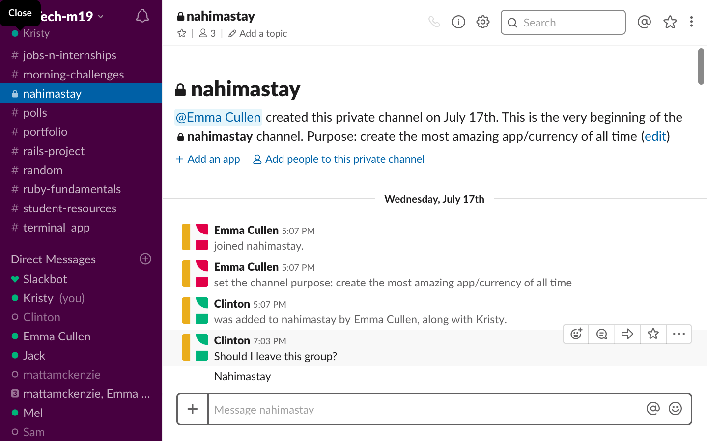
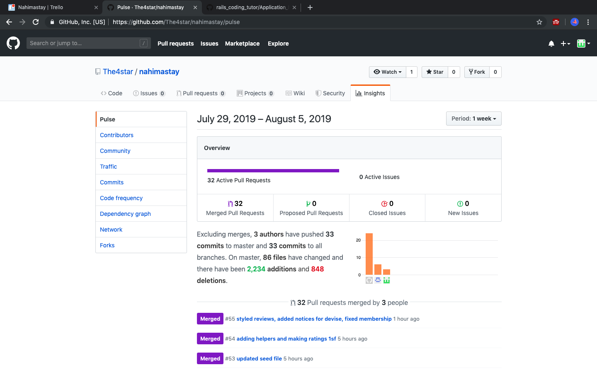

## README
______________________________________________________________________________________
# Nah..ImaStay

## Contributors

##### | Clinton Forster |        https://github.com/The4Star |

##### | Emma Cullen | https://github.com/ |

##### Kristy Lake | https://github.com klps007|

##### | Clinton Forster | Emma Cullen   | Kristy Lake |
________________________________________________________________________________________________
## Links

##### URL - https://nahmastay.herokuapp.com/

##### GitHub - https://github.com/Nah..ImaStay
________________________________________________________________________________________________

### Section 1 - Description
### Section 2 - Design Documents
### Section 3 - Planning Process
### Section 4 - Short question & answers
________________________________________________________________________________________________
## SECTION 1 - DESCRIPTION

________________________________________________________________________________________________
### Purpose 

A reciprocal platform where travelers host and stay at each others homes in return for karma Coins.

Karma coins are earned by hosting travelers first and can then be saved up and spent on your own stays along your journey.

Let us break it down for you

Hosting people first gives you the chance to see if sharing space with a new friend is something you are comfortable with before you start your own travels.

It also gives the person that stays with you a chance to let everyone else know how great a host you were, making people much more willing to host you and leaving all members of the community feeling secure.

Karma Coins?

These are a currency exclusive to Nah..ImaStay. They don't cost any money but you do need to earn them to spend them simply by hosting your fellow travelers and making new friends.

Guests review their hosts and vice versa so that future hosts and guests can see how great it is to meet you and feel safe!

The more people you host the more Karma Coins you'll earn and the more you can travel without spending any real money! Simple!
___________________________________________________________________
### Functionality / Features

* Secure Login, User Authentication and Authorization
* Profile Simple User friendly interface displaying both guest and host data
* Profile Photo and Accommodation Photos uploaded using AWS image Storage
* Simple User friendly interface 
* Search, view availability and book accommodation
* Host and guest can communicate directly via internal messaging system
* Membership upgrade premium payable through Stripe 
* Give and view accommodation review and rating
* Give and view guest review and rating
* View all past stay and future booked stays
* View all past guests and future booked guests
* View Karma
___________________________________________________________________
### Tech Stack

Front-end: HTML, ERB, CSS
Back-end: Ruby, Ruby on Rails
Database: PostgreSQL Database with ActiveRecord
Deployment: Heroku
___________________________________________________________________
### Configuration / Installation Instructions

In the terminal:

1. Copy and paste the following into the terminal where you want to install:

  	git clone git@github.com:The4star/nah..imastay
    .git

2. change into the file:

    cd  nahimastay
/

3. Input the following in terminal this will open postgres:
   	
    psql postgres

4. Then copy and paste the following: 

 	create role nahimastay
     with createdb login password '123456';

5. Exit out of progress back to terminal by entering:

     \q

6. Now input this to terminal

    rails db:create

7. And start the server with:

    rails s

8. Open browser and put the following in the address bar:

    localhost:3000
___________________________________________________________________
### Site Map
 

___________________________________________________________________
### Screenshots

##### Screenshots - Front End

###### Home and About Us

###### Sign up and Sign in Pages

 

###### Profile Pages

###### Membership Pages

###### Accommodation Pages

###### Stay Pages

##### Screenshots - Back End

 
___________________________________________________________________

## SECTION 2 - DESIGN DOCUMENTATION 
___________________________________________________________________

### Design process

##### MockUps Figma -  
https://www.figma.com/file/fglPB5H0edn2CTdPFMvXS3/Nah..ImaStay?node-id=0%3A1

 

 

 

 
___________________________________________________________________

### A workflow diagram of the user journey/s.
 
 ##### Workflow diagram of users journey

___________________________________________________________________

### Database Entity Relationship Diagrams
 
 ###### Database ERD

 
___________________________________________________________________
## SECTION 3 - PLANNING PROCESS 
___________________________________________________________________
### Project plan & timeline

##### Project Plan

#####  Initial Planning

 
 

##### Slack

### Screenshots of Trello board(s)

##### Trello board

        
 

 
___________________________________________________________________
## SECTION 4 - Short Answer Questions (Section 2.2)
___________________________________________________________________
#### 1. What is the need (i.e. challenge) that you will be addressing in your project?

Some people would like to be able to travel the world and stay for free with likeminded individuals, whilst feeling safe and secure.

Who doesn't love free accommodation and making new friends around the world and feeling safe while doing so?

#### 2. Identify the problem you’re trying to solve by building this particular marketplace App? Why is it a problem that needs solving?

In the current marketplace for this kind of service, the problem is that the currently available solutions are not very secure. It is hard to have peace of mind about the kind of people you will sharing an accommodation with. 

Nah..ImaStay is a platform to facilitate participation in a community of people with similar values and goals, in that every user has to be both a host and a guest. 

This removes situations that are common with current couch surfing solutions, such as one questionable person only renting a place to travellers for unknown motives. 

Nah..ImaStay is a reciprocal society which also means that everyone must host guests - avoiding people simply travelling and not giving back.

#### 3. Describe the project will you be conducting and how. your App will address the needs.

Nah..ImaStay was created as a solution of making couch surfing more secure and safe. The setup of Nah..ImaStay is intended to offer more peace of mind about the kinds of people we are hosting and staying with.

When you host people you earn Karma Coins which you can then spend on your own travels. This concept can be expanded in the future to cover other services, and encourages the culture of giving things to others for benefits that do not revolve around financial gain.

Nah..ImaStay provides a safe and secure platform for people to search, book, stay and host couch surfing availabilities Worldwide. The internal messaging systems provides a means of effective communication between the host and guest

#### 4. Describe the network infrastructure the App may be based on.

Nah..ImaStay is deployed via Heroku's deployment platform, Heroku offer a free service allowing for apps to be quickly and easily created and deployed without the cost of owning a server or network infrastructure.

Development - Developed using rails, source code was written and database established and committed to GitHub as a means of source and version control

Build - Once coding was complete and committed GitHub the code is pushed to Herko, bundle file known as a slug is prepared within Heroku

Deployment - once ready the slug is executed in Dyno, Heroku's mini operating system responsible for running and managing the app, environmental variable and third party application where included to extend functionality.

A version of Nah..ImaStay is delivered.

#### 5. Identify and describe the software to be used in your App.

HTML - HyperText Markup Language responsible for structure of a web page

ERB - Responsible for rendering data in the browser

CSS - Cascading Style Sheets responsible for styling the web page.

RUBY - flexible object-orientated programming language

RUBY ON RAILS - Web application framework written in Ruby and used to create fullstack web applications

POSTGRESQL DATABASE -  A popular Relational Database Management System based on the SQL Database Language

ACTIVE RECORD -  Enable code to be written in other languages like ruby and is the means in which we can talk to the database and request information

GIT & GITHUB - Are responsible for Source control, merging to the master via GitHub enable team collaboration on projects

HEROKU -  Handles deployment of web applications without owning your own database or server infrastructure and can be pushed directly from github. 

#### 6. Identify the database to be used in your App and provide a justification for your choice.

PostgreSQL is relational database, making it easy to manipulate and access data, it is extremely flexible and robust through support for user-defined objects and their behaviors including data types,functions, operators, domains and indexes. 

PostgreSQL allows for complex data structures to be created, stored and retrieved and supports a variety of geometric data types such as points, lines, circles, and polygons and works smoothly with Rails for the build and Heroku for deployment.

#### 7. Identify and describe the production database setup (i.e. postgres instance).

Nah...ImaStay's production database is an instance of a postgres database, hosted on Heroku and built with Ruby on Rails 

The instance of PostgreSQL database was created when the app was created via rails new Nah..ImaStay --database=postgresql and then rails db:create and db:migrate to set up the tables and columns thus forming our database. For testing purposes dummy data was seeded via the seed.rb file

We initially created an local instance of a PostgreSQL database using Ruby on Rails by calling the flag -d postgresql when creating the Rails app. We then call 'rails db:create' and set up our tables and columns using migrations: eg 'rails g model user' & 'rails g migration AddNameToUser'. This database then becomes our Development and testing database which we seed with fake data using the seeds.rb file.

Production is achieved via our database migration and schema pushed to Heroku from GitHub and set up for deployment within Heroku, 'heroku db:create' and 'heroku run' are called from the command line.

For Production, the Migrations and Schema of our Development Database are pushed to Heroku from the GitHub repository,then set up within Heroku. To do this we run the same commands to create the database and run migrations, only we put 'heroku run' before the command. Structure of our Heroku database, schema and migrations are the same allowing for seeding via seed.rb 

#### 8. Describe the architecture of your App.

##### Architecture Diagram

Client - Sends and receives HTTP requests to and from the web server 

Web Server - Processes HTTP requests and directs the request to the requested Route

Routes - Pathways defined with the application responsible for functions called by the controller in accordance to the request received from the server, common HTTP requests include GET, DELETE, POST, PATCH/update

Controller - Contains the logic and the functions requested by the server and is responsible for database queries, requesting required files and telling the webpage how to display database information

Views - Tells the browser what to display rendering the final representation of the users request

ORM - translates the code from the controller to native SQL language allowing for data to be received by the app

Database - PostgreSQL relational database

#### 9. Explain the different high-level components (abstractions) in your App.

M (MODEL) - Handles the structure of the data in the database or object relationships / database associations 

V (VIEW) - Handles graphical user interface objects and presentation, what is rendered in the browser

C (CONTROLLER) - Handles the user interface and application, provides the logic and contains the functions requested by the web server, receives request from browser, retrieves requested data from model and sends to views   

ACTIVE RECORD - Handles all the database related tasks and communication, establishes a connection with the database server, retrieves data from tables and stores new data in the database

ACTIVE STORAGE - Is responsible for image uploads

#### 10.  Detail any third party services that your App will use.

##### Key Gems / Modules:

Pundit - User Authorization module used to manage users access to particular routes and sections of application protecting the integrity of the data

Devise - User Authentication module used to manage user registration, sign-in, passwords, confirmation etc

AWS / Active Storage - hosting service for image uploads via Amazon Web Services

GeoCoder - Computational process of transforming a physical address description and providing geographical coordinates corresponding to that location

S3 Module - Image Storage from Amazon Web Services

Stripe - Payment processing Software as a Service (SASS) from Stripe allowing users to pay Premium Membership Fees within the app using credit card.

##### Full List of Dependencies:

* ruby "2.5.5"
* gem "stripe'
* gem "devise"
* gem "geocoder"
* gem "aws-sdk-s3", require: false
* gem "rails", "~> 5.2.3"
* gem "pg", ">= 0.18", "< 2.0"
* gem "puma", "~> 3.11"
* gem "sass-rails", "~> 5.0"
* gem "uglifier", ">= 1.3.0"
* gem "coffee-rails", "~> 4.2"
* gem "turbolinks", "~> 5"
* gem "jbuilder", "~> 2.5"
* gem "bootsnap", ">= 1.1.0", require: false
* group :development, :test do
* gem "byebug", platforms: [:mri, :mingw, :x64_mingw]
* group :development do
* gem "web-console", ">= 3.3.0"
* gem "listen", ">= 3.0.5", "< 3.2"
* gem "spring"
* gem "spring-watcher-listen", "~> 2.0.0"
* group :test do
* gem "capybara", ">= 2.15"
* gem "selenium-webdriver"
* gem "chromedriver-helper"
* gem "tzinfo-data", platforms: [:mingw, :mswin, :x64_mingw, :jruby]
* gem "devise", "~> 4.6"

#### 11.Describe (in general terms) the data structure of marketplace apps that are similar to your own (e.g. eBay, Airbnb).

Airbnb - Built with Rails Airbnb uses Amazon Web Services for image uploads, users have one login for both host and guest users with information being displayed on separate profile pages. Relevant services are in place to handle the massive amounts of data

#### 12. Discuss the database relations to be implemented.

Role has_many user, users has_one role and has_one profile (profile belongs_to users) 

Users has_one profile and has_one accommodation (property) has_many stays (guests) and has_one_attached relationship for image upload  

Stays belongs_to and has_one accommodation, one stay has_one accommodation review and has_one guest review, one stay has_many messages, messages has_one stay

Accommodation has_one and belongs_to User (Host) has_one accommodation type, has_many stays (guests), and has_one_attached relations for hero and interior images

#### 13. Describe your project’s models in terms of the relationships (active record associations) they have with each other.

##### User: 

  belongs_to :role 
  has_many :stays
  has_one :profile
  has_one :accommodation

##### Profile:

  belongs_to :user   
  has_one_attached :uploaded_image

##### Role:
   has_many :users

##### Accommodation:

  belongs_to :host
  belongs_to :accomtype
  has_many :stays
  has_one_attached :hero_image
  has_one_attached :interior_image
  geocoded_by :city

##### Accommodation type:

  has_one :accommodation

##### Accommodation Review:

has_one :stays

##### Stays: 

  belongs_to :accommodation  
  belongs_to :guest   
  has_many :messages  
  has_one :accommodationreview  
  has_one :guestreview

##### Guest Review:
  has_one :stay

##### Message:
   has_one :stay

#### 14. Provide your database schema design.
 
##### Database Schema Design

#### 15. Provide User stories for your App.

##### "As a Guest (User who is not signed in), I should be able to ..."

* View the Home Page, read about the app's purpose and it's basic functionality
* Search for accommodation by Country, City and dates 
* View host reviews
* Create new Account using email and password
* View options for membership 

##### "As a Standard Member (Non-Paying User), I should be able to ..."

* Login and create a Profile, write a bio, provide personal details, select membership type, and upload a profile photo
* Edit my profile at any time
* Create accommodation profile with multiple image uploads 
* Switch easily between host and guest profiles
* View all historic current and future booked stays
* View all historic, current and future booked guests
* Write a review for completed stays
* Write a review for guests after there stay
* Edit or cancel any (and only) stays or guests
* Edit / Delete and (and only) reviews I created
* Send up to 2 accommodation requests per day
* Have the option to upgrade membership
* Have the option to cancel membership
* Have the option to deactivate my account

##### "As a Premium Member (Paying User), I should be able to ..."

* Login and create a Profile, write a bio, provide personal details,select membership type, and upload profile photo
* Edit my profile at any time
* Create accommodation profile with multiple image uploads 
* Switch easily between host and guest profiles
* View all previous current and future stays
* View all previous, current and future guests
* Write a review for completed stays
* Write a review for guests after there stay
* Edit or cancel any (and only) stays or guests
* Edit / Delete and (and only) reviews I created
* Send unlimited accommodation requests per day
* Have the option to cancel membership
* Have the option to deactivate my account

##### "As an Administrator User, I should be able to ..."

* Edit / Delete content, including reviews and user inputed data
* View an Administrator Dashboard
* View all profiles 
* View financial data
* View past, current and future booking data
* Cancel membership
* Cancel and deactivate Users

#### 16. Provide Wireframes for your App.

#### 17. Describe the way tasks are allocated and tracked in your project.

Trello was used to allocate and track task, included columns for planning, design, build, stretch goals and rubric and organized tasks accordingly. 

The team member completing the task assigns it to them self and moves the trello card to the "Doing" and then "Done" column on completion. 

This system made it easy for everyone to know what the everyone else was working on reducing conflict with pulling and pushing to github.

#### 18. Discuss how Agile methodology is being implemented in your project.

Agile methodology has been implemented in our project through close communication, sprint planning and breaking down tasks and assigning to team members thus allowing us to complete the project in the given short amount of time

Small projects can be implemented very quickly. For large projects, it is difficult to estimate the development time.

We had sprint meetings a the start and end of each week to discuss tasks to be completed and make any planning decisions.

The product or task backlog list was then updated on trello so everyone was aware of what was being worked on and the goals to complete for the day. 

User stories include experience as a guest, host and as an admin user to include a wider perspective.

#### 19. Provide an overview and description of your Source control process.

For source control we used:

* Git CLI 
* GitHub and 
* Heroku 
* CLI (for source control / version control)

We created a new respiratory on GitHub and then created a new branch separate from the master and then pushed the branch to git hub once the work had been completed. Once assigning yourself the task from the trello board the new branch is created protecting the master from screw ups and mishaps. 

##### Heroku

##### GitHub

 
 

#### 20. Provide an overview and description of your Testing process.

##### Testing record

 

#### 21. Discuss and analyze requirements related to information system security.

Confidentiality - Ensures the necessary level of secrecy is enforced at each junction of data processing and prevents unauthorized disclosure. This level of confidentiality should prevail while data resides on systems and devices within the network, as it is transmitted and once it reaches its destination. This can be achieved through access restrictions, data encryption and proper training of users.

Integrity - Integrity of data is protected when the assurance of accuracy and reliability of information and system is provided, and unauthorized modification is prevented. This can be achieved through strict access control

Availability - Ensures reliability and timely access to data and resources to authorized individuals achieved by data backups, IDS monitoring and certain firewall and router configurations

#### 22. Discuss methods you will use to protect information and data.

Protecting information and data is achieved through authorization and authentication to protect systems’ and individual files, appropriate virus protection / firewalls in place prevent vulnerability of data, adequate data back up allowing the business to survive a disaster or major data loss. 

Lastly a cyber security policy outlining technology and information assets of the business, the threats to those assets, the rules and controls for protecting them as well as the responsibilities of employees and approved users 

#### 23. Research what your legal obligations are in relation to handling user data.

Australian businesses have a legal obligation to adhere to guidelines for the collection, storing, provision of access and the management of personal information on individuals as stated in Australian Privacy Principles (APPs) in the Privacy Act (1988) and other related legislation. It is a legal requirement for businesses to make available a clear and up-tp-date privacy policy setting out how personal information will be handled 

In the instance of a data breach business must comply with the Notifiable Data Breaches scheme under the Privacy Act 1988. If a data breach involves personal information and is likely to cause serious harm to an individual, both the individual involved and the Office of Australian Information Commissioner (OAIC) must be notified. 

It is a legal obligations to consider the safety of personal information about users from hackers, cyber thefts, data loss and in the event of a disaster. 

